# Rich Markdown Editor 📝✨

[](https://marketplace.visualstudio.com/)
[](LICENSE)
[](https://www.typescriptlang.org/)

A premium, highly integrated **WYSIWYG Markdown Editor** custom-tailored for VS Code and agentic environments like Antigravity. Built on top of the robust **Toast UI Editor** engine, it replaces the standard raw text view with a stunning, interactive, and live-rendered workspace that feels natively embedded in the editor workspace.

---

## 🗺️ Architectural Sequence

Understanding how the extension host and webview communicate is key to contributing or extending the editor. The diagram below illustrates the lifecycle and event-flow of editing a markdown document:

```mermaid
sequenceDiagram
    autonumber
    participant User as VS Code Editor / User
    participant Provider as MarkdownEditorProvider (Extension Host)
    participant Webview as Webview HTML/JS (Toast UI & Mermaid)
    participant Doc as vscode.TextDocument

    User->>Provider: Open markdown file (*.md)
    Provider->>Provider: resolveCustomTextEditor()
    Provider->>Webview: Inject HTML template (with VS Code CSS tokens)
    Webview->>Provider: Post "ready" message
    Provider->>Webview: Send initial document text ("update" message)
    Webview->>Webview: Parse frontmatter + markdown body
    Webview->>Webview: Render WYSIWYG editor and overlay containers

    rect rgb(28, 28, 38)
        Note over Webview,Doc: Document Editing Loop
        Webview->>Provider: Post "save" message with updated content
        Provider->>Doc: Execute WorkspaceEdit (replace text range)
        Doc-->>Provider: Trigger onDidChangeTextDocument event
        Provider->>Webview: Dispatch "update" message (if text differs)
    end

    rect rgb(28, 28, 38)
        Note over Webview,Provider: Event Hijacking & Native Commands
        Webview->>Provider: Post "openLink" on local/relative path click
        Provider->>User: Resolve workspace path & open in editor
        User->>Webview: Press Cmd/Ctrl + F
        Webview->>Webview: Display #custom-find overlay & search text using window.find()
    end
```



---

## 🚀 Key Features Under the Hood

Unlike generic Markdown previews, this extension operates as a custom VS Code editor matching `*.md` files. It includes highly advanced workarounds to solve standard webview limitations:

### 🧩 1. Multi-Pane Frontmatter Editor
Most markdown editors choke on YAML frontmatter, showing raw dashes and config keys mixed in the WYSIWYG workspace. 
- **The Solution:** The editor intercepts and extracts frontmatter on load.
- It displays a dedicated, collapsible **"YAML Metadata (Skill Trigger Data)"** text area at the top of the workspace.
- Edits to either the frontmatter pane or the markdown editor body are merged cleanly and synced back to VS Code's `TextDocument` in real-time.

### 🧜 2. Absolute-Positioned Mermaid Overlays
ProseMirror (Toast UI's underlying document model) systematically strips out external DOM elements and custom HTML templates inside the rich editor surface, making live WYSIWYG rendering of diagram libraries like Mermaid extremely challenging.
- **The Solution:** The editor utilizes an invisible pointer-events wrapper (`#mermaid-overlays-container`) positioned absolutely in the DOM.
- It measures the exact bounding rectangles of mermaid codeblocks in the ProseMirror editing pane.
- It constructs corresponding absolute preview cards positioned directly under the code blocks.
- It automatically garbage-collects orphaned preview nodes when their source code blocks are deleted or modified.

### 🔍 3. Integrated Native Search (Chromium IPC Bypass)
Standard webview elements in VS Code cannot access the editor's global find widget due to iframe-level sandbox restrictions and focus traps.
- **The Solution:** We implement a custom search overlay widget (`#custom-find`) that hooks directly into the `cmd+f` / `ctrl+f` keystrokes.
- Under the hood, it triggers Chromium's native `window.find()` API. This allows searching directly inside the shadow DOM and editable fields instantly, bypassing IPC messaging overhead.
- Includes full keyboard navigation: `Enter` moves to the next match, `Shift + Enter` moves to the previous match, and `Escape` closes the widget.

### 🔒 4. Viewport Scroll-Jumping Lock
Updating text via the ProseMirror API causes heavy layout recalculations, causing the editor to jump and scroll erratic distances when synchronizing edits with the extension host.
- **The Solution:** A 60fps Scroll Lock mechanism triggers upon document update messages. Using `requestAnimationFrame` over `45` consecutive frames, it anchors `scrollTop = 0` to overpower erratic ProseMirror layout jumps and preserve layout stability.

### 🔗 5. Smart Link Interception
Links in standard webview custom editors are normally unclickable or crash because they run in an isolated environment.
- **The Solution:** We intercept both `click` and `mousedown` event bubbles in the webview.
- Relative document links (e.g. `./another-file` or `subfolder/doc.md`) are resolved contextually relative to the active document.
- Local resources and external URLs are routed through `vscode.commands.executeCommand('vscode.open')` or `vscode.env.openExternal` respectively, facilitating fluid cross-document editing.

---

## 📁 Repository Structure

```
├── .vscode-test/             # Generated electron runtimes for testing
├── out/                      # Compiled TypeScript outputs (git-ignored)
├── src/
│   ├── extension.ts          # Extension entry point, registers MarkdownEditorProvider
│   ├── markdownEditor.ts     # Main class, webview HTML generation, event processing
│   └── test/
│       ├── runTest.ts        # Bootstraps the Electron VS Code test suite
│       └── suite/
│           ├── extension.test.ts # Core mocha test specifications
│           └── index.ts      # Test runner configuration
├── sim.js                    # Headless JSDOM simulation script for CI/quick tests
├── test_gen.js               # Helper to extract and save HTML webview code for inspection
├── tsconfig.json             # TypeScript compiler settings
└── package.json              # Extension metadata and contribution details
```

---

## 🛠️ Development & Build Commands

Ensure you have [Node.js](https://nodejs.org/) installed before starting development.

### 1. Install Dependencies
```bash
npm install
```

### 2. Compile TypeScript
To compile the TypeScript source files once:
```bash
npm run compile
```

To watch for file changes and auto-compile (recommended for development):
```bash
npm run watch
```

### 3. Run Extension in Development
1. Open the project folder in VS Code.
2. Press `F5` (or click `Run and Debug` -> `Run Extension`).
3. A new **Extension Development Host** window will open.
4. Open any `.md` file to test the WYSIWYG editor!

---

## 🧪 Testing Strategies

This project is equipped with two unique testing strategies to ensure maximum reliability and developer velocity:

### ⚙️ Option A: Headless JSDOM Simulator (Fast Feedback Loop)
Spins up a headless virtual browser inside Node.js using `jsdom` to emulate VS Code postMessage interfaces and verify that Toast UI behaves as expected. Ideal for quick checks and automated CI environments:
```bash
# Compiles the TS code first
npm run compile

# Runs the simulator
node sim.js
```
The simulator will parse `markdownEditor.ts`, extract the embedded HTML document, mock the `acquireVsCodeApi` method, trigger simulated markdown document update sequences, and assert if elements render successfully inside the virtual DOM.

### 🖥️ Option B: VS Code Electron Integration Tests
Launches a real instance of VS Code inside a headless Electron context to verify editor registration, custom editor views, tab focus, and file-saving:
```bash
npm test
```

---

## ⚙️ VS Code Extension Contribution Specifications

The extension contributes the following integration parameters to VS Code via `package.json`:

```json
"contributes": {
  "commands": [
    {
      "command": "richMarkdown.find",
      "title": "Find in Rich Markdown Editor"
    }
  ],
  "keybindings": [
    {
      "command": "richMarkdown.find",
      "key": "ctrl+f",
      "mac": "cmd+f",
      "when": "activeCustomEditorId == 'richMarkdown.wysiwygEditor'"
    }
  ],
  "customEditors": [
    {
      "viewType": "richMarkdown.wysiwygEditor",
      "displayName": "Rich Markdown Editor",
      "selector": [
        {
          "filenamePattern": "*.md"
        }
      ],
      "priority": "default"
    }
  ]
}
```

---

## 💎 Design System & UX Standards

The editor inherits VS Code’s high-fidelity design standards:
- **Consistent Colors:** Employs standard token variables like `var(--vscode-editor-background)` and `var(--vscode-editor-foreground)` to seamlessly blend in with the user's active theme.
- **Glassmorphic Panels:** The custom find widget is decorated with smooth micro-borders and subtle translucent drop-shadow overlays to look premium and unobtrusive.
- **Underlined Blue Hyperlinks:** Overrides Toast UI content standards to color editable anchors cleanly (`#3794ff`), reinforcing clear clickability patterns.

## 🤝 Contributing & Extension Guidelines
- **HTML Injection Code:** The HTML string template in `src/markdownEditor.ts` is the heart of the webview interface. If editing DOM behaviors or importing new script resources, remember to update the corresponding simulation scripts (`sim.js` / `test_gen.js`) to maintain test alignment.
- **ProseMirror Schemas:** Be cautious when extending DOM tags inside Toast UI's body; ProseMirror is strict and will discard nodes it doesn't recognize unless they are mapped as independent floating elements outside the main container, or integrated explicitly via Toast UI's Custom HTML Renderers.
